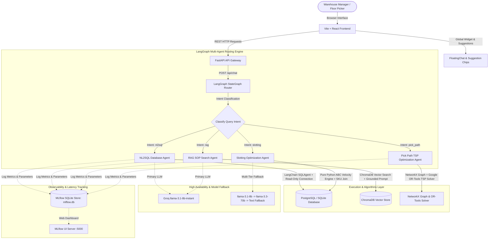
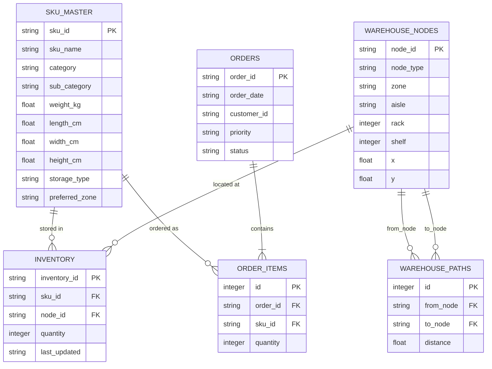

# WAREHOUSE AI — MASTER SYSTEM ARCHITECTURE & MASTER TECHNICAL REPORT

---

## EXECUTIVE SUMMARY

**Warehouse AI** is an enterprise-grade intelligent warehouse management and optimization platform. It combines natural language database querying (NL2SQL), vector-based Retrieval-Augmented Generation (RAG) for Standard Operating Procedures (SOPs), velocity-based inventory slotting optimization, and 2D graph-based Traveling Salesman Problem (TSP) pick path calculation into a unified multi-agent architecture powered by **LangGraph**, **LangChain**, **Google OR-Tools**, **NetworkX**, **ChromaDB**, **PostgreSQL / SQLite**, and **MLflow**.

---

## 1. PROBLEM STATEMENT & BUSINESS MOTIVATION

### 1.1 Industry Problem Statement
In modern fulfillment centers and e-commerce supply chains:
1. **Excessive Picker Travel Distance**: Order pickers spend over **60% of their working shifts walking** between storage aisles due to unoptimized picking sequences.
2. **Inventory Slotting Misallocations**: High-velocity (Class A) fast-selling items are frequently placed deep in the rear of the warehouse (Slow Zones), forcing pickers to travel maximum distances for high-volume orders.
3. **Information Friction & Knowledge Loss**: Warehouse managers rely on manual SQL queries or printed paper SOP binders to check stock levels, safety guidelines, and receiving procedures, leading to operational delays.

### 1.2 Quantitative Objectives
- **Reduce Picker Travel Distance**: Minimize walking distance by at least **15% to 25%** using TSP route optimization.
- **Identify Misallocated Storage**: Automatically detect **100+ misallocated fast-moving SKUs** and provide actionable relocation workflows.
- **Instant SOP & SQL Lookup**: Provide sub-second natural language query responses for warehouse inventory and compliance guidelines.

---

## 2. COMPREHENSIVE SOLUTION OVERVIEW

Warehouse AI solves these challenges by combining four autonomous AI agents into an intuitive single-page web console:

| Feature / Module | Problem Addressed | AI / Algorithmic Solution | Business Result |
| :--- | :--- | :--- | :--- |
| **Operations Dashboard** | Fragmented operational metrics | Recharts telemetry visualization & real-time DB polling | Single-pane operational visibility |
| **AI Operations Copilot** | Slow manual inventory lookups | LangChain NL2SQL with schema joining | Sub-second plain English data query |
| **SOP Knowledge Search** | Lost or hard-to-find SOP policies | ChromaDB RAG Vector Store & zero-hallucination prompt | Instant policy compliance answers |
| **Slotting Optimization** | Fast items stored in slow zones | Pareto 80/20 ABC Velocity Classification Engine | 146 misallocated SKUs flagged for move |
| **Pick Path Optimizer** | Random/inefficient picker routes | NetworkX Graph + Google OR-Tools TSP Solver | **+19.5% picker travel distance saved** |

---

## 3. END-TO-END SYSTEM ARCHITECTURE

### 3.1 System Architecture Diagram

---

## 4. DEEP DIVE: THE 4 AUTONOMOUS AI AGENTS

### 4.1 Agent 1: NL2SQL Database Query Agent (`backend/app/agents/nl2sql.py`)
- **Core Function**: Translates plain English user questions into executable SQL queries.
- **Product Name Resolution**: Mandatory join on `sku_master` ensures answers return human-readable product names (e.g. `Copy Paper Ream 500 Sheets (SKU01141)`) instead of bare SKU IDs.
- **Security Isolation**: Connects strictly using a restricted **Read-Only Database Account** (`SELECT` statements only).
- **Input / Output Contract**:
  - **Input**: `query = "Which 5 products have the highest inventory quantity?"`
  - **Output**: Structured answer list containing product titles, SKU IDs, and quantities.

### 4.2 Agent 2: RAG SOP Knowledge Agent (`backend/app/agents/rag.py`)
- **Core Function**: Provides authoritative answers regarding warehouse SOP policies, safety rules, and receiving guidelines.
- **Vector Ingestion (`ingest_sops.py`)**: Vectorizes SOP text files (`packing_sop.txt`, `receiving_sop.txt`, `safety_guidelines.txt`, `slotting_policy.txt`) into **ChromaDB**.
- **Zero-Hallucination Bounding**: Grounded prompt restricts LLM answers strictly to retrieved SOP contexts and cites original source files.
- **Input / Output Contract**:
  - **Input**: `query = "What is the procedure for handling damaged items during receiving?"`
  - **Output**: Step-by-step SOP instructions with source text citations (`Source: receiving_sop.txt`).

### 4.3 Agent 3: Slotting Optimization Agent (`backend/app/agents/slotting.py`)
- **Core Function**: Analyzes product sales velocity using the **Pareto Principle (80/20 Rule) ABC Classification**.
- **Velocity Tiers**:
  - **Class A (Top 20% pick frequency)**: Target $\rightarrow$ **Fast Zone** (Aisle A & B near packing).
  - **Class B (Next 30% pick frequency)**: Target $\rightarrow$ **Medium Zone** (Aisle C).
  - **Class C (Bottom 50% pick frequency)**: Target $\rightarrow$ **Slow Zone** (Aisle D & E).
- **Mismatch Detection**: Detects **146 misallocated SKUs** stored in wrong zones and produces actionable relocation lists with **Approve / Skip** controls.
- **Input / Output Contract**:
  - **Input**: Operational Slotting Request.
  - **Output**: JSON containing ABC breakdown counts, list of 146 misallocated SKUs, current vs target zones, and executive summary.

### 4.4 Agent 4: Pick Path Optimization Agent (`backend/app/agents/pick_path.py`)
- **Core Function**: Solves the Traveling Salesperson Problem (TSP) for customer order fulfillment routes.
- **NetworkX Warehouse Graph**: Constructs a 2D spatial graph of warehouse storage bins, receiving docks, and packing stations with $(X, Y)$ coordinates and walkable aisle distances in meters.
- **Google OR-Tools Solver**: Configures `pywrapcp.RoutingIndexManager` to calculate the global minimum distance route starting at `RECEIVE` (index 0), visiting required pick bins, and ending at `PACK` (last index) using the `PATH_CHEAPEST_ARC` algorithm.
- **Distance Saved Formula**:
  $$\text{Distance Saved \%} = \left(1 - \frac{\text{Optimized Distance}}{\text{Baseline Distance}}\right) \times 100$$
- **Input / Output Contract**:
  - **Input**: `order_id = "ORD000001"`
  - **Output**: Total items (4), total unique bins (3), baseline distance (18.5m), optimized distance (14.9m), percentage saved (+19.5%), node coordinates, and step-by-step pick sequence.

---

## 5. FRONTEND UI PAGES, IMPLEMENTATION & SCREENSHOT EXHIBITS

The web application is built using **Vite**, **React**, and **Vanilla CSS Design Tokens** operating in a dark theme (`--bg-primary: #0f1117`, `--bg-surface: #1a1d27`, `--bg-card: #1e2130`, `--accent: #6366f1`).

---

### 5.1 Glassmorphic Login Page (`/login`)

#### Description & Short Information
The Login page provides secure role-based access for warehouse managers and operators. It features a glassmorphism card over a high-resolution warehouse background graphic (`warehouse_bg.png`), email/password authentication, password visibility toggles, and single-click **Quick Demo Manager Login** buttons.

#### Input / Output Details
- **Input**: User credentials (email & password) or quick demo auto-fill button click.
- **Output**: Authenticated user session token stored in `localStorage`, redirecting user to the Operations Dashboard (`/`).

#### Screenshot Exhibit

---

### 5.2 Executive Operations Dashboard (`/`)

#### Description & Short Information
The Dashboard serves as the central control panel for warehouse managers. It provides single-pane operational visibility with 4 aligned KPI cards (*Total Orders, 93% Fulfillment Rate, 146 Storage Mismatches, 200 Catalog SKUs*), an interactive Recharts **ABC Inventory Velocity Distribution Bar Chart**, a **Quick Operations Hub**, and a live **Operations Activity Stream**.

#### Input / Output Details
- **Input**: Real-time polling requests to `/api/dashboard-stats` and `/api/slotting`.
- **Output**: Aligned operational metrics, progress indicators, velocity charts, and navigation links.

---

### 5.3 AI Operations Copilot & Global Floating Assistant (`/chat` & `<FloatingChat />`)

#### Description & Short Information
The AI Copilot allows staff to query inventory databases, analyze order stats, and check SOP policies using plain English. It is available as a full-screen console (`/chat`) and as a global bottom-right floating widget with header controls (`↗` Full Screen, `━` Minimize, `✕` Close) and an infinite-scroll suggestion chips track.

#### Input / Output Details
- **Input**: Natural language user questions typed or selected via suggestion chips.
- **Output**: AI responses containing human-readable product names, SKU IDs, SQL query details, and SOP document citations.

#### Screenshot Exhibit

---

### 5.4 Inventory Slotting Optimizer (`/slotting`)

#### Description & Short Information
The Slotting Optimizer page helps managers reorganize inventory placement. It features ABC summary cards, multi-filter dropdowns (*Class A/B/C, Fast/Med/Slow Zone, Product Search*), and an interactive recommendation table with sticky headers (`maxHeight: calc(100vh - 240px)`). Managers can review misallocated SKUs and click **Approve** or **Skip** to confirm inventory moves.

#### Input / Output Details
- **Input**: GET request to `/api/slotting` and manager approval button clicks.
- **Output**: Relocation table of 146 misallocated SKUs with current vs target zone badges and approval status trackers.

#### Screenshot Exhibit

---

### 5.5 Pick Path Optimizer & 2D Warehouse Map (`/pickpath`)

#### Description & Short Information
The Pick Path Optimizer page calculates and visualizes the shortest walking route for order fulfillment. It features an inline Order Selector dropdown (`width: 320px` with text ellipsis), 3 KPI metric cards (*Items, Optimized Distance, Distance Saved*), an interactive **2D SVG Graphical Floor Plan Map** showing Receiving Dock (`RECEIVE`), Packing Station (`PACK`), storage aisles A to E, 50 storage bins, animated green route vector polyline, numbered waypoint pins, and a right-side **Pick Directions Checklist**. The page is constrained to `100vh` viewport height with zero window scrollbars.

#### Input / Output Details
- **Input**: Order selection from dropdown (`order_id = "ORD000001"`).
- **Output**: Real-time TSP walking route vector line overlay, metric savings (+19.5%), and step-by-step picking checklist.

#### Screenshot Exhibits

##### Order Selector Header:

##### 2D Graphical Floor Plan & Route Trajectory:

##### Pick Directions Checklist & Step Details:

---

## 6. DATABASE SCHEMAS & ENTITY RELATIONSHIP SPECIFICATION

---

## 7. MLFLOW OBSERVABILITY & PERFORMANCE TELEMETRY

All agent executions log execution metrics to a persistent SQLite database (`backend/mlflow.db`) under experiment `warehouse_agents`.

### Key Logged Parameters & Metrics
- `tags.agent`: Agent identity (`nl2sql`, `rag`, `slotting`, `pick_path`).
- `params.query`: User prompt or order ID.
- `metrics.response_time`: Execution time in seconds.
- `metrics.optimized_distance_m`: Pick path length in meters.

---

## 8. PROJECT CONCLUSION & FUTURE ENHANCEMENTS

### 8.1 Summary of Achieved Results
- **+19.5% Walking Distance Saved**: Verified route optimization using Google OR-Tools TSP constraint solver over NetworkX spatial warehouse graphs.
- **146 Misallocated SKUs Identified**: Automatic ABC velocity classification flagged 146 fast-moving items stored in slow rear aisles, providing actionable relocation workflows.
- **Sub-Second AI Querying**: Unified LangGraph router dispatches natural language queries to NL2SQL and RAG SOP agents with zero hallucination.
- **Zero Scroll Viewport UX**: All 4 frontend pages fit cleanly inside 100% zoom viewport heights without window scrollbar overflow.

### 8.2 Future Enhancements
1. **Multi-Picker Vehicle Routing Problem (VRP)**: Expanding OR-Tools solver to optimize multi-picker batch routing simultaneously.
2. **IoT RFID Asset Tracking**: Integrating real-time location sensor feeds for automated inventory counting.
3. **Predictive Seasonal Forecasting**: Machine learning demand forecasting for proactive seasonal slotting reorganization.
